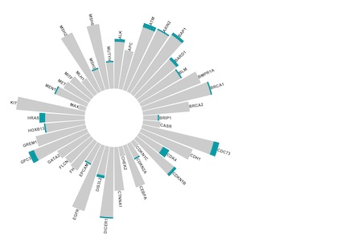
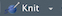
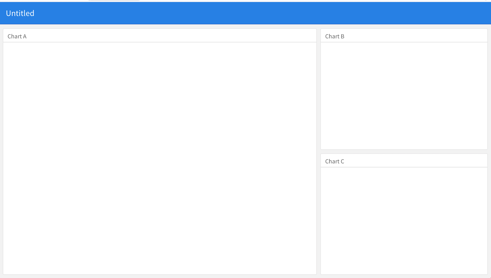

# Clinical Trial Dashboards with R and Flexdashboard
m.golafshar  
_Access the code and data for the examples in this document [here](https://github.com/mgolafshar/clinical-dashboards)._    



Deploying dashboards for monitoring clinical trials has many benefits. Dashboards provide a simple way for investigators to keep track of study accrual and stratification factors. They provide a centralized way of monitoring the safety of a the trial by tracking realtime feedback on adverse events experienced by patients. As trial protocols may have associated quality of life surveys that are administered at key timepoints, dashboards provide a way of tracking overall completion rates as well as patient level information assisting study staff in monitoring potential protocol deviations.

The dashboard we will build below utilizes the [R programming language](https://www.r-project.org/about.html) and [flexdashboard](https://rmarkdown.rstudio.com/flexdashboard/), an R package that leverages syntax from [RMarkdown](https://rmarkdown.rstudio.com/index.html), a report authoring framework, to layout the structural elements of a dashboard. The great thing about this set of tools is they are relatively quick to get up and running, and, they are free to download. That's right! __Free!!!__  


## Setting up R & RStudio
Before we can get started building our dashboard you will need to have R installed on your computer.
- Download R from [here](https://cloud.r-project.org/).  

We will also need the RStudio IDE _(Integrated Development Envirmonment)_. Think of RStudio as a nice wrapper around the R engine, making it easier to navigate and get things done.
- Download the free version of RStudio from [here](https://rstudio.com/products/rstudio/download/#download).  

You will want to make sure you are familiar with the RStudio IDE  before getting started. Some really nice introductions can be found [here](https://moderndive.netlify.app/1-1-r-rstudio.html) and [here](https://datacarpentry.org/genomics-r-intro/01-introduction/index.html).

## Installing the necessary packages

Now that you have R and RStudio up and running, you will need to install the a few packages that will help us on our way to building our first dashboard. You can install the currently-released versions of the packages we will use by running the following command in the R console.

``` r
install.packages(c("flexdashboard","tidyverse", "shiny"))
```

## Getting started
Let's start by opening a new flexdashboard file by going to __File__ -> __New File__ and choosing __RMarkdown File__ from the dropdown list. That will open up the following window. 

  

Select __From Template__ on the left and __Flex Dashboard__ from the template window on the right, then hit __OK__.

That will open up a new RMarkdown file with some placeholder code that should look like this.

````
---
title: "Untitled"
output: 
  flexdashboard::flex_dashboard:
    orientation: columns
    vertical_layout: fill
---

```{r setup, include=FALSE}
library(flexdashboard)
```

Column {data-width=650}
-----------------------------------------------------------------------

### Chart A

```{r}

```

Column {data-width=350}
-----------------------------------------------------------------------

### Chart B

```{r}

```

### Chart C

```{r}

```
````

Above your code in the RStudio toolbar you will see a knit button  with a dropdown list. Select ```Knit to flex_dashboard```. You will be asked to name the new dashboard file and select a place to save the file to. Once complete, the RMarkdown file will render and... just like that... we have our first _(template)_ dashboard. 
  

May not be the most exciting dashboard, but, it's easy to see that with very little effort, we are able to generate the scaffolding for a dashboard where we can start visualizing our clinical data.


## Flexdashboard structure
A dashboard built with flexdashboard contains four basic elements.
1) the YAML - (blueprint for how the file is rendered)
2) RMarkdown - (text and structure)
3) Code - (all the stuff you want to put in your dashboard)
4) Shiny - (adds interactivity)


For deployment options, see https://shiny.rstudio.com/deploy/). 


